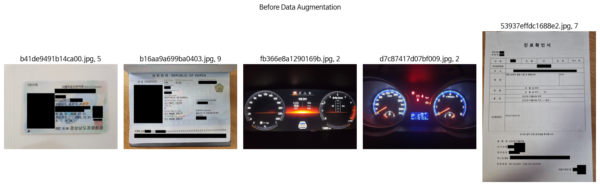

[](https://classroom.github.com/a/FVjNDCrt)
# Document Type Classification | 문서 타입 분류
## Team

|  |  |  |  |  |
| :--------------------------------------------------------------: | :--------------------------------------------------------------: | :--------------------------------------------------------------: | :--------------------------------------------------------------: | :--------------------------------------------------------------: |
|            [김나리](https://github.com/narykkim)             |            [박범철](https://github.com/Bomtori)             |            [서혜교](https://github.com/andWHISKEY)             |            [조용중](https://github.com/paanmego)             |            [최윤설](https://github.com/developzest)             |
|                            팀장, 발표, EDA, Pre-processing, Data Augmentation, Modeling                             |                            EDA, Modeling, OCR                             |                 EDA, Pre-processing, Data Argumentation, Modeling                   |                            EDA, Pre-processing, Data Augmentation, Modeling, OCR                             |                            EDA, Pre-processing, Data Augmentation, Modeling                       |

## 1. Competiton Info

### Overview

- 소개
이번 대회는 computer vision domain에서 가장 중요한 태스크인 이미지 분류 대회입니다.

이미지 분류란 주어진 이미지를 여러 클래스 중 하나로 분류하는 작업입니다. 이러한 이미지 분류는 의료, 패션, 보안 등 여러 현업에서 기초적으로 활용되는 태스크입니다. 딥러닝과 컴퓨터 비전 기술의 발전으로 인한 뛰어난 성능을 통해 현업에서 많은 가치를 창출하고 있습니다.

<p align="center">
  
</p>

그 중, 이번 대회는 문서 타입 분류를 위한 이미지 분류 대회입니다. 문서 데이터는 금융, 의료, 보험, 물류 등 산업 전반에 가장 많은 데이터이며, 많은 대기업에서 디지털 혁신을 위해 문서 유형을 분류하고자 합니다. 이러한 문서 타입 분류는 의료, 금융 등 여러 비즈니스 분야에서 대량의 문서 이미지를 식별하고 자동화 처리를 가능케 할 수 있습니다.

이번 대회에 사용될 데이터는 총 17개 종의 문서로 분류되어 있습니다. 1570장의 학습 이미지를 통해 3140장의 평가 이미지를 예측하게 됩니다. 특히, 현업에서 사용하는 실 데이터를 기반으로 대회를 제작하여 대회와 현업의 갭을 최대한 줄였습니다. 또한 현업에서 생길 수 있는 여러 문서 상태에 대한 이미지를 구축하였습니다.

<p align="center">
  
</p>

이번 대회를 통해서 문서 타입 데이터셋을 이용해 이미지 분류를 모델을 구축합니다. 주어진 문서 이미지를 입력 받아 17개의 클래스 중 정답을 예측하게 됩니다. computer vision에서 중요한 backbone 모델들을 실제 활용해보고, 좋은 성능을 가지는 모델을 개발할 수 있습니다. 그 밖에 학습했던 여러 테크닉들을 적용해 볼 수 있습니다.

본 대회는 결과물 csv 확장자 파일을 제출하게 됩니다.

- input : 3140개의 이미지

- output : 주어진 이미지의 클래스

### Timeline

- 2024년 7월 29일 : 대회시작 각자 데이터 EDA
- 2024년 7월 30일 ~ 8월 2일 : 온라인 강의, 데이터 Augmentation을 이용한 모델링, Baseline code 학습
- 2024년 8월 5일 : Swin Tranform, Convnext v2 적용
- 2024년 8월 6일 : OCR, Augrapy 코드 공유 적용
- 2024년 8월 7일 : 데이터 오프라인 증강, Test data의 Denoising 적용
- 2024년 8월 8일 : 각자의 모델 Hyper parameter tuning, LM3 적용
- 2024년 8월 9일 ~ 11일 : 각자의 모델 학습시키면서 리더보드 올리기


## 2. Components

### Directory


e.g.
```
├── BeomCheol/
│   ├── ReadMe.md
│   └── efficientnet_code.ipynb
├── cho (조용중)
│   ├── README.md
│   ├── layoutmv3.py
│   ├── model.ipynb
│   ├── multimodal_model.ipynb
│   ├── multimodel_model.py
│   └── preprocessing.ipynb
├── developzest (최윤설)
│   ├── developzest_EDA.ipynb
│   └── developzest_baseline_code.ipynb
├── hyegyo/
│   ├── README.md
│   └── train_code.ipynb
├── nary/
│   ├── <Nary-related files>
│   └── <More files or subdirectories>
└── README.md

```


## 3. Data descrption

### Dataset overview

- 주어진 학습 데이터에 대한 정보는 다음과 같습니다.
- train [폴더]
    - 1570장의 이미지가 저장되어 있습니다.
- train.csv [파일]
<p align="center">
  
</p>

- 1570개의 행으로 이루어져 있습니다. train/ 폴더에 존재하는 1570개의 이미지에 대한 정답 클래스를 제공합니다.

- ID 학습 샘플의 파일명

- target 학습 샘플의 정답 클래스 번호

### EDA

- class 별 학습데이터의 양이 고르지 못함.

- 이미지들의 사이즈 분포 시각화.


<br>

### Data Processing

- 이미지의 크기를 모델의 최적사이즈에 맞추기좋게 이미지를 가운데에 두고 여백을 주면서 정방형으로 만든 다음 리사이즈.
  
- 이미지의 회전 바로잡기(Denosing)
  
  
- - 학습 데이터에 오분류된 데이터 확인하여 label 수정
  
- 학습 데이터는 대체로 clean한 반면 평가 데이터는 상/하/좌/우 반전 및 회전등이 적용된 noise 데이터
- 직사각형 이미지 99%

  <br>

### Data Augmentation

- 평가 데이터 셋에 대한 분석을 통해 'augraphy' 의 다양한 기능 적용
  1. 윤곽선 감지를 사용하여 텍스트 선을 감지하고 부드러운 텍스트 취소선, 강조 또는 밑줄 효과 추가
  2. 이미지에 낙서 적용
  3. 입력 용지의 색상 변경
  4. 잉크 번짐 효과 (두 이미지 혼합하여 블리드스루 효과)
  5. 접기 효과
  6. 조명 또는 밝기 그래디언트
  7. 종이 표면에 그림자 효과
  8. 크기 조정(resizing), 뒤집기(flips), 회전(rotation) 등 기본적인 기하학적 변환 적용
- torchvision.transforms v1과 호환되는 v2 사용
- 적용 전
  
- 적용 후
  


  <br>


## 4. Modeling

### Model descrition

- EfficientNet_b4
- SWIN(Shifted Window)
- ConvNeXt
- OCR
---
# <EfficientNet 모델>
EfficientNet은 이미지 분류와 같은 컴퓨터 비전 태스크를 위한 딥러닝 모델입니다. 이 모델은 기존의 ConvNet 모델들을 효율적으로 확장할 수 있는 방법을 제시하여, 정확도와 연산 효율성의 균형을 최적화합니다.


## EfficientNet 소개

EfficientNet은 **성능**과 **효율성**을 동시에 고려하여 개발된 모델로, MobileNet과 ResNet을 포함한 기존의 모델들을 대체할 수 있는 경쟁력 있는 선택지입니다. EfficientNet은 모델의 크기를 확장하면서도, 성능의 감소 없이 계산 복잡도를 줄이는 데 중점을 둡니다.

### 확장 전략: Compound Scaling

EfficientNet의 핵심 개념은 **Compound Scaling**입니다. 이는 모델의 너비(width), 깊이(depth), 해상도(resolution)를 균형 있게 확장하여 최적의 성능을 달성하는 방법입니다.

- **너비(width)**: 네트워크의 채널 수를 증가시켜 더 많은 특징을 학습
- **깊이(depth)**: 네트워크의 레이어 수를 증가시켜 더 깊은 특징을 학습
- **해상도(resolution)**: 입력 이미지의 해상도를 높여 더 세밀한 정보를 학습

이러한 확장 전략은 단순히 하나의 요소만을 확장하는 기존 방법과 달리, 세 가지 요소를 동시에 조정하여 더 효율적인 모델을 만듭니다.

### 모델 아키텍처

EfficientNet은 **MBConv**라는 모바일 친화적인 블록을 사용합니다. 이는 기존의 Convolutional Layer보다 적은 연산으로 동일한 성능을 달성하는 핵심 요소입니다.

| Stage | 해상도     | 채널 수 |
|-------|------------|---------|
| 1     | H/2 × W/2  | 16C     |
| 2     | H/4 × W/4  | 24C     |
| 3     | H/8 × W/8  | 40C     |
| 4     | H/16 × W/16| 80C     |
| 5     | H/32 × W/32| 112C    |
| 6     | H/64 × W/64| 192C    |
| 7     | H/128 × W/128| 320C  |

### 효율적인 연산

EfficientNet은 다음과 같은 요소를 통해 연산 효율성을 극대화합니다:

- **MBConv Block**: 깊이별 분리 합성곱(Depthwise Separable Convolution)과 Squeeze-and-Excitation 기법을 결합하여 성능과 효율성을 높임
- **스케일링 방법**: 너비, 깊이, 해상도의 조합을 통해 연산량 대비 성능을 최적화

### 비교 및 성능

EfficientNet은 기존의 모델들과 비교하여 더 적은 파라미터와 FLOPs(Floating Point Operations)로 유사하거나 더 나은 성능을 제공합니다. 예를 들어, EfficientNet-B7 모델은 ImageNet 데이터셋에서 매우 높은 정확도를 기록하면서도, ResNet-50과 같은 기존 모델들보다 훨씬 적은 연산량을 요구합니다.

### 활용 사례

EfficientNet은 다양한 컴퓨터 비전 태스크에서 사용될 수 있습니다. 예를 들어:

- 이미지 분류
- 객체 탐지(Object Detection)
- 세그멘테이션(Segmentation)

EfficientNet의 효율적인 연산 구조 덕분에, 모바일 기기와 같이 자원이 제한된 환경에서도 탁월한 성능을 발휘할 수 있습니다.

### 수학적 표현

EfficientNet에서 사용되는 주요 연산은 다음과 같습니다:

$$
Y = \text{Conv}(X, W) + B
$$

여기서:
- $X$는 입력 데이터
- $W$는 가중치
- $B$는 편향(bias)
- $\text{Conv}$는 합성곱 연산을 의미

### 모델 복잡도 및 파라미터 수

EfficientNet은 다양한 버전(B0 ~ B7)으로 제공되며, 각 버전은 모델의 복잡도와 성능이 다릅니다. 모델의 파라미터 수와 FLOPs는 이미지 해상도와 네트워크 깊이에 비례하여 증가합니다.

- **EfficientNet-B0**: 기본 모델, 약 5.3M 파라미터
- **EfficientNet-B7**: 확장된 모델, 약 66M 파라미터

EfficientNet은 파라미터 수와 계산량이 증가하면서도 선형적으로 성능이 향상되는 특성을 보입니다.
EfficientNet은 성능과 효율성의 균형을 최적화한 모델로, 컴퓨터 비전 분야에서 다양한 응용이 가능합니다.

---

## SWIN (Shifted Window) 모델

SWIN은 컴퓨터 비전 태스크를 위한 딥 러닝 아키텍처입니다. CNN의 지역성과 Transformer의 전역 정보 처리 능력을 결합하여 효율적이고 강력한 성능을 제공합니다.


### 이미지 분할 및 임베딩

- 입력 이미지 (H×W×3)를 작은 패치로 분할
- 각 패치를 선형 임베딩으로 고차원 벡터로 변환

### 계층적 특징 추출

모델은 4개의 stage로 구성되며, 각 stage에서 이미지 해상도와 채널 수가 변화합니다:

| Stage | 해상도 | 채널 수 |
|-------|--------|---------|
| 1     | H/4 × W/4 | 48C |
| 2     | H/8 × W/8 | 2C |
| 3     | H/16 × W/16 | 4C |
| 4     | H/32 × W/32 | 8C |

### Swin Transformer Block

각 stage의 핵심 구성 요소:
- Window Multi-head Self Attention (W-MSA)
- Shifted Window Multi-head Self Attention (SW-MSA)
- Multi-Layer Perceptron (MLP)
- Layer Normalization (LN)

### 윈도우 기반 self-attention

- 전체 이미지 대신 작은 윈도우 내에서 self-attention 수행
- 계산 복잡도: O(n^2)에서 O(n)으로 감소
  - n: 전체 토큰 수
  - M: 윈도우 크기

### Shifted Window 메커니즘

- 연속된 층에서 윈도우 위치를 교대로 이동
- 윈도우 간 정보 교환 가능

### 패치 병합 (Patch Merging)

- 각 stage 사이에 적용
- 공간 해상도를 줄이고 채널 수를 증가
- 인접한 2×2 패치의 특징을 연결하고 선형 변환 적용

### 수학적 표현


$$
\text{Attention}(Q, K, V) = \text{softmax}\left(\frac{QK^T}{\sqrt{d}}\right)V
$$

여기서:
- $Q$, $K$, $V$는 각각 Query, Key, Value 행렬
- $d$는 임베딩 차원

## 8. 모델 복잡도

- 파라미터 수와 계산량이 이미지 크기에 선형적으로 비례
- 기존 Vision Transformer의 제곱 복잡도보다 효율적

SWIN 모델은 효율성과 성능을 모두 고려한 설계로, 다양한 컴퓨터 비전 태스크에서 우수한 결과를 보여줍니다.

---

<br><br><br>

## ConvNeXt V2 모델

ConvNeXt V2는 비전 태스크를 위한 CNN 아키텍처입니다. 이 모델은 ConvNeXt의 개선된 버전으로, Transformer의 강점을 CNN 구조에 효과적으로 통합하여 뛰어난 성능과 효율성을 가집니다.


### 모델 개요

ConvNeXt V2는 다음과 같은 특징을 가진 최신 CNN 아키텍처입니다:

- ConvNeXt의 개선된 버전으로, 더욱 강력한 성능 제공
- CNN의 계산 효율성과 Transformer의 강력한 표현력을 결합
- 이미지 분류, 객체 탐지, 세그멘테이션 등 다양한 비전 태스크에 적용 가능
- 최신 딥러닝 기술을 통합하여 성능과 효율성 향상

### 주요 구성 요소

ConvNeXt V2의 핵심 구성 요소는 다음과 같습니다:

- Fully Convolutional 설계
- Global Response Normalization (GRN)
- Inverted Bottleneck
- Scaled Dot-Product Attention (SDPA)

각 구성 요소는 모델의 성능과 효율성 향상에 중요한 역할을 합니다.

### Fully Convolutional 설계

ConvNeXt V2는 전통적인 CNN 구조를 기반으로 하되, 다음과 같은 혁신적인 설계를 적용했습니다:

- 7x7 depthwise convolution 사용으로 넓은 수용 영역 확보
- 채널 간 정보 교환을 위한 1x1 convolution 적용
- 전체적으로 fully convolutional 구조를 유지하여 다양한 입력 크기에 대응 가능

이러한 설계는 모델의 유연성과 성능을 동시에 향상시킵니다.

### Global Response Normalization (GRN)

GRN은 ConvNeXt V2의 핵심 중 하나로, 다음과 같은 특징을 가집니다:

- 채널 간 의존성을 효과적으로 모델링
- 특징 맵의 전역적 정보를 활용하여 local response normalization의 한계 극복
- 수식: 

  $$y = x \cdot \left(1 + \gamma \cdot \left(\frac{\sum x^2}{N}\right)^{0.5}\right)$$

  여기서 $x$는 입력 특징, $\gamma$는 학습 가능한 파라미터, $N$은 채널 수


### Inverted Bottleneck

Inverted Bottleneck 구조는 MobileNetV2에서 영감을 받아 설계되었으며, 다음과 같은 이점을 제공합니다:

- 채널 수를 일시적으로 확장했다가 다시 축소하는 방식
- 계산 효율성 향상 및 모델의 표현력 증가
- 적은 파라미터로 복잡한 특징을 효과적으로 학습 가능

이 구조는 모델의 경량화와 성능 향상에 크게 기여합니다.

### Scaled Dot-Product Attention (SDPA)

SDPA는 Transformer에서 영감을 받은 주의 메커니즘으로, 다음과 같은 특징을 가집니다:

- 전역적 의존성을 효과적으로 모델링
- 특징 맵의 서로 다른 영역 간의 관계를 학습

### 계층적 구조

ConvNeXt V2는 4개의 stage로 구성된 계층적 구조를 가집니다:

| Stage | 출력 크기 | 채널 수 |
|-------|-----------|---------|
| 1     | H/4 × W/4 | 96     |
| 2     | H/8 × W/8 | 192    |
| 3     | H/16 × W/16 | 384   |
| 4     | H/32 × W/32 | 768   |

각 stage는 여러 개의 ConvNeXt V2 블록으로 구성되며, 이러한 계층적 구조는 다양한 스케일의 특징을 효과적으로 학습할 수 있게 해줍니다.

### 모델 복잡도

ConvNeXt V2는 효율적인 설계로 다음과 같은 특징을 가집니다:

- 파라미터 수와 계산량이 이미지 크기에 선형적으로 비례
- ViT와 같은 Transformer 모델보다 높은 계산 효율성
- 다양한 크기의 모델 제공 (Tiny, Small, Base, Large)로 서로 다른 요구사항에 대응

이러한 특성은 ConvNeXt V2를 다양한 환경과 하드웨어에서 유연하게 사용할 수 있게 합니다.

### 성능 및 응용

ConvNeXt V2는 다양한 컴퓨터 비전 태스크에서 우수한 성능을 보여줍니다:

- ImageNet 분류에서 최고 수준의 정확도 달성
- COCO 객체 탐지 및 세그멘테이션에서 뛰어난 성능
- 적은 계산 리소스로 효율적인 학습 및 추론 가능

이 모델은 자율주행, 의료 영상 분석, 로보틱스 등 다양한 실제 응용 분야에서 활용될 수 있습니다.

ConvNeXt V2는 CNN과 Transformer의 장점을 결합한 아키텍처로, 다양한 비전 문제에 대한 효과적인 모델을 제공합니다. 

### Modeling Process

1. Augmentation으로 데이터증강하여 3개의 모델 실험 (flip, noise, rotation)
    -> 과적합의 문제, 0.91이상으로는 잘 오르지 않음
    -> 두개의 모델들을 앙상블한 결과도 0.92정도
2. 하이퍼파라미터 튜닝
3. 데이터를 오프라인으로 증강시켜 학습. (약 25000개)
    -> swin과 conv의 경우 단일모델에서 0.92 후반, 앙상블후 0.93
4. 평가데이터 Denoising
    -> swin 모델을 사용할 경우 0.0011이 오름.
5. 훈련데이터를 회전 후 일부러 Denosing
    -> swin conv 앙상블로 그동안보다 가장 높은 점수를 얻음 0.9386
6. Paddle OCR을 이용한 단어 추출 후 단어사전을 만들어 분류 (3, 4, 7, 14 클래스만 적용함) https://api.wandb.ai/links/narykkim/p2l1gyy0

## 5. Result

### Leader Board
- 리더보드[중간 순위]
  <br>

- 리더보드[최종 순위]
  <br>

- 4등,cv12, F1_Score : 0.9530, 제출 횟수 : 85

<br>

---

# 후기

<br>

- 김나리 : 데이터를 이미지와 문서로 분류해서 다시 분류하는 시스템을 만들고 싶었는 데, 초반에 데이터량이 적다보니 좋은 결과가 나오지 않아 중단했다. 이미지를 오프라인으로 증강한 후에 시도했으면 좋았을텐데 그러지 못해 아쉽다. Paddle OCR을 시간관계상 깊이 공부하지 못하고 지나갔는 데, 좀더 체계적으로 만들어보고싶다. OCR 대회를 기대해본다.

- 박범철 : Confusion Matrix에서 단일 분류모델에서 FN, FP를 가져와 OCR을 도전했지만, 출력 크기 오류 때문에 시간을 많이 잡아먹었던 점이 아쉽다. OCR 관련하여 오류를 고치고 계속 시도, 세 가지 모델을 앙상블 하였을 때 배깅 비율을 다르게, 데이터 증강쪽을 좀 더 전문적으로 실시를 시도해보고 싶다. 

- 서혜교 : Augraphy 제대로 구현해보기, SwinT 논문부터 제대로 심도깊게 읽고 리뷰하기.

- 조용중 : 다양한 모델을 테스트하고, 실제 CV 프로젝트에서 데이터 증강이나 모델 선택, 모델 성능향상 기법등 다양한 실험을 해 보았던것이 좋은 경험 이었음

- 최윤설 : train dataset에 augraphy 적용한 1570개 데이터로 모델 앙상블 없이 Macro F1 Score가 0.907이 나왔는데 이걸 아예 데이터를 늘리고 앙상블했으면 어땠을 까... 하다보니 이것저것 시도해보고 싶은 게 많았는데 시간이 부족해서 아쉬움이 있었고 다음부터는 대회 오픈하자마자 이것저것 해봐야 겠다고 생각함.

<br>

---

# 인사이트

<br>

- 김나리 : 데이터 전처리는 정말 중요하다. 모델을 파인튜닝하는 것도 중요하지만, 적절한 학습데이터가 훨씬 더 좋은 결과를 줄수 있다.

- 조용중 : Train/Test에 대한 확인이나 가설&검증의 중요성, 다양한 모델 구조를 정확하게 파악하고 로우한 코드 작성을 해 보는것도 학습에 도움이 될듯.

- 최윤설 : augraphy를 적용하면서 albumentations과 구조적인 차이 이해 및 Compose 구성 시 입/출력 이해할 수 있었고, 매 대회를 진행하면서 느끼는 점은 EDA를 통한 데이터 전처리의 중요성을 뼈저리게 느끼고 있음.

- 박범철 : 모델보다는 EDA를 자세히 만들고 전처리 과정이 더 중요한 것 같다. 전처리쪽에 더욱 힘을 실어 해야할 것 같다. 결국 점수 향상의 비결은 데이터인 것 같다.
