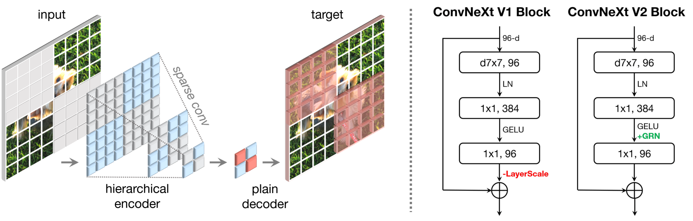

 

---

# <아쉬었던 점>
- OCR 부분을 시도했지만 성공적인 결과는 못 얻은점.
- model 부분에서 Pretrained=True/False 에 대해서 충분히 테스트를 하지 못한점.

 

---

# <개선하고 싶은 점>
- 초기 Preprocessing 을 좀더 다양하게 시도했었으면.
- test 데이터를 꼼꼼히 살펴볼것.

 

---

# <시도해 보고 싶은 점>
- 최신 모델을 논문 참조하여 로우 레벨로 구현해 보는것.
- 오류가 큰 하위 몇개 클래스들에 대해서 계층적으로 가중치를 주고 모델에 적용해 보는것.

 
 
 

# SWIN (Shifted Window) 모델

SWIN은 컴퓨터 비전 태스크를 위한 딥 러닝 아키텍처입니다. CNN의 지역성과 Transformer의 전역 정보 처리 능력을 결합하여 효율적이고 강력한 성능을 제공합니다.

## 목차

1. [이미지 분할 및 임베딩](#1-이미지-분할-및-임베딩)
2. [계층적 특징 추출](#2-계층적-특징-추출)
3. [Swin Transformer Block](#3-swin-transformer-block)
4. [윈도우 기반 self-attention](#4-윈도우-기반-self-attention)
5. [Shifted Window 메커니즘](#5-shifted-window-메커니즘)
6. [패치 병합 (Patch Merging)](#6-패치-병합-patch-merging)
7. [수학적 표현](#7-수학적-표현)
8. [모델 복잡도](#8-모델-복잡도)

## 1. 이미지 분할 및 임베딩

- 입력 이미지 (H×W×3)를 작은 패치로 분할
- 각 패치를 선형 임베딩으로 고차원 벡터로 변환

## 2. 계층적 특징 추출

모델은 4개의 stage로 구성되며, 각 stage에서 이미지 해상도와 채널 수가 변화합니다:

| Stage | 해상도 | 채널 수 |
|-------|--------|---------|
| 1     | H/4 × W/4 | 48C |
| 2     | H/8 × W/8 | 2C |
| 3     | H/16 × W/16 | 4C |
| 4     | H/32 × W/32 | 8C |

## 3. Swin Transformer Block

각 stage의 핵심 구성 요소:
- Window Multi-head Self Attention (W-MSA)
- Shifted Window Multi-head Self Attention (SW-MSA)
- Multi-Layer Perceptron (MLP)
- Layer Normalization (LN)

## 4. 윈도우 기반 self-attention

- 전체 이미지 대신 작은 윈도우 내에서 self-attention 수행
- 계산 복잡도: O(n^2)에서 O(n)으로 감소
  - n: 전체 토큰 수
  - M: 윈도우 크기

## 5. Shifted Window 메커니즘

- 연속된 층에서 윈도우 위치를 교대로 이동
- 윈도우 간 정보 교환 가능

## 6. 패치 병합 (Patch Merging)

- 각 stage 사이에 적용
- 공간 해상도를 줄이고 채널 수를 증가
- 인접한 2×2 패치의 특징을 연결하고 선형 변환 적용

## 7. 수학적 표현

$$
\text{Attention}(Q, K, V) = \text{softmax}\left(\frac{QK^T}{\sqrt{d}}\right)V
$$

여기서:
- $Q$, $K$, $V$는 각각 Query, Key, Value 행렬
- $d$는 임베딩 차원

## 8. 모델 복잡도

- 파라미터 수와 계산량이 이미지 크기에 선형적으로 비례
- 기존 Vision Transformer의 제곱 복잡도보다 효율적

---

SWIN 모델은 효율성과 성능을 모두 고려한 설계로, 다양한 컴퓨터 비전 태스크에서 우수한 결과를 보여줍니다.

   

# ConvNeXt V2 모델

ConvNeXt V2는 비전 태스크를 위한 CNN 아키텍처입니다. 이 모델은 ConvNeXt의 개선된 버전으로, Transformer의 강점을 CNN 구조에 효과적으로 통합하여 뛰어난 성능과 효율성을 가집니다.

## 목차

1. [모델 개요](#1-모델-개요)
2. [주요 구성 요소](#2-주요-구성-요소)
3. [Fully Convolutional 설계](#3-fully-convolutional-설계)
4. [Global Response Normalization (GRN)](#4-global-response-normalization-grn)
5. [Inverted Bottleneck](#5-inverted-bottleneck)
6. [Scaled Dot-Product Attention (SDPA)](#6-scaled-dot-product-attention-sdpa)
7. [계층적 구조](#7-계층적-구조)
8. [모델 복잡도](#8-모델-복잡도)
9. [성능 및 응용](#9-성능-및-응용)

## 1. 모델 개요

ConvNeXt V2는 다음과 같은 특징을 가진 최신 CNN 아키텍처입니다:

- ConvNeXt의 개선된 버전으로, 더욱 강력한 성능 제공
- CNN의 계산 효율성과 Transformer의 강력한 표현력을 결합
- 이미지 분류, 객체 탐지, 세그멘테이션 등 다양한 비전 태스크에 적용 가능
- 최신 딥러닝 기술을 통합하여 성능과 효율성 향상

## 2. 주요 구성 요소

ConvNeXt V2의 핵심 구성 요소는 다음과 같습니다:

- Fully Convolutional 설계
- Global Response Normalization (GRN)
- Inverted Bottleneck
- Scaled Dot-Product Attention (SDPA)

각 구성 요소는 모델의 성능과 효율성 향상에 중요한 역할을 합니다.

## 3. Fully Convolutional 설계

ConvNeXt V2는 전통적인 CNN 구조를 기반으로 하되, 다음과 같은 혁신적인 설계를 적용했습니다:

- 7x7 depthwise convolution 사용으로 넓은 수용 영역 확보
- 채널 간 정보 교환을 위한 1x1 convolution 적용
- 전체적으로 fully convolutional 구조를 유지하여 다양한 입력 크기에 대응 가능

이러한 설계는 모델의 유연성과 성능을 동시에 향상시킵니다.

## 4. Global Response Normalization (GRN)

GRN은 ConvNeXt V2의 핵심 중 하나로, 다음과 같은 특징을 가집니다:

- 채널 간 의존성을 효과적으로 모델링
- 특징 맵의 전역적 정보를 활용하여 local response normalization의 한계 극복
- 수식: 

  $$y = x \cdot \left(1 + \gamma \cdot \left(\frac{\sum x^2}{N}\right)^{0.5}\right)$$

  여기서 $x$는 입력 특징, $\gamma$는 학습 가능한 파라미터, $N$은 채널 수

## 5. Inverted Bottleneck

Inverted Bottleneck 구조는 MobileNetV2에서 영감을 받아 설계되었으며, 다음과 같은 이점을 제공합니다:

- 채널 수를 일시적으로 확장했다가 다시 축소하는 방식
- 계산 효율성 향상 및 모델의 표현력 증가
- 적은 파라미터로 복잡한 특징을 효과적으로 학습 가능

이 구조는 모델의 경량화와 성능 향상에 크게 기여합니다.

## 6. Scaled Dot-Product Attention (SDPA)

SDPA는 Transformer에서 영감을 받은 주의 메커니즘으로, 다음과 같은 특징을 가집니다:

- 전역적 의존성을 효과적으로 모델링
- 특징 맵의 서로 다른 영역 간의 관계를 학습

## 7. 계층적 구조

ConvNeXt V2는 4개의 stage로 구성된 계층적 구조를 가집니다:

| Stage | 출력 크기 | 채널 수 |
|-------|-----------|---------|
| 1     | H/4 × W/4 | 96     |
| 2     | H/8 × W/8 | 192    |
| 3     | H/16 × W/16 | 384   |
| 4     | H/32 × W/32 | 768   |

각 stage는 여러 개의 ConvNeXt V2 블록으로 구성되며, 이러한 계층적 구조는 다양한 스케일의 특징을 효과적으로 학습할 수 있게 해줍니다.

## 8. 모델 복잡도

ConvNeXt V2는 효율적인 설계로 다음과 같은 특징을 가집니다:

- 파라미터 수와 계산량이 이미지 크기에 선형적으로 비례
- ViT와 같은 Transformer 모델보다 높은 계산 효율성
- 다양한 크기의 모델 제공 (Tiny, Small, Base, Large)로 서로 다른 요구사항에 대응

이러한 특성은 ConvNeXt V2를 다양한 환경과 하드웨어에서 유연하게 사용할 수 있게 합니다.

## 9. 성능 및 응용

ConvNeXt V2는 다양한 컴퓨터 비전 태스크에서 우수한 성능을 보여줍니다:

- ImageNet 분류에서 최고 수준의 정확도 달성
- COCO 객체 탐지 및 세그멘테이션에서 뛰어난 성능
- 적은 계산 리소스로 효율적인 학습 및 추론 가능

이 모델은 자율주행, 의료 영상 분석, 로보틱스 등 다양한 실제 응용 분야에서 활용될 수 있습니다.

---

ConvNeXt V2는 CNN과 Transformer의 장점을 결합한 아키텍처로, 다양한 비전 문제에 대한 효과적인 모델을 제공합니다. 