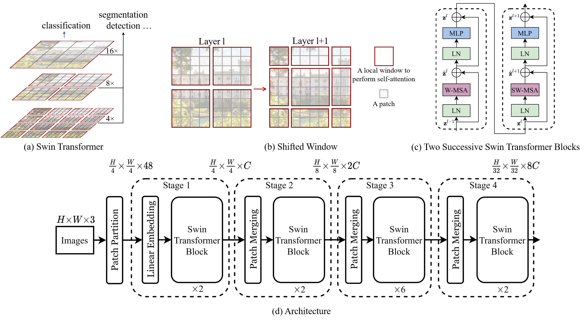

# SWIN (Shifted Window) 모델

SWIN은 컴퓨터 비전 태스크를 위한 혁신적인 딥 러닝 아키텍처입니다. CNN의 지역성과 Transformer의 전역 정보 처리 능력을 결합하여 효율적이고 강력한 성능을 제공합니다.

## 목차

1. [이미지 분할 및 임베딩](#1-이미지-분할-및-임베딩)
2. [계층적 특징 추출](#2-계층적-특징-추출)
3. [Swin Transformer Block](#3-swin-transformer-block)
4. [윈도우 기반 self-attention](#4-윈도우-기반-self-attention)
5. [Shifted Window 메커니즘](#5-shifted-window-메커니즘)
6. [패치 병합 (Patch Merging)](#6-패치-병합-patch-merging)
7. [수학적 표현](#7-수학적-표현)
8. [모델 복잡도](#8-모델-복잡도)

## 1. 이미지 분할 및 임베딩

- 입력 이미지 (H×W×3)를 작은 패치로 분할
- 각 패치를 선형 임베딩으로 고차원 벡터로 변환

## 2. 계층적 특징 추출

모델은 4개의 stage로 구성되며, 각 stage에서 이미지 해상도와 채널 수가 변화합니다:

| Stage | 해상도 | 채널 수 |
|-------|--------|---------|
| 1     | H/4 × W/4 | 48C |
| 2     | H/8 × W/8 | 2C |
| 3     | H/16 × W/16 | 4C |
| 4     | H/32 × W/32 | 8C |

## 3. Swin Transformer Block

각 stage의 핵심 구성 요소:
- Window Multi-head Self Attention (W-MSA)
- Shifted Window Multi-head Self Attention (SW-MSA)
- Multi-Layer Perceptron (MLP)
- Layer Normalization (LN)

## 4. 윈도우 기반 self-attention

- 전체 이미지 대신 작은 윈도우 내에서 self-attention 수행
- 계산 복잡도: O(n^2)에서 O(n)으로 감소
  - n: 전체 토큰 수
  - M: 윈도우 크기

## 5. Shifted Window 메커니즘

- 연속된 층에서 윈도우 위치를 교대로 이동
- 윈도우 간 정보 교환 가능

## 6. 패치 병합 (Patch Merging)

- 각 stage 사이에 적용
- 공간 해상도를 줄이고 채널 수를 증가
- 인접한 2×2 패치의 특징을 연결하고 선형 변환 적용

## 7. 수학적 표현

$$
\text{Attention}(Q, K, V) = \text{softmax}\left(\frac{QK^T}{\sqrt{d}}\right)V
$$

여기서:
- $Q$, $K$, $V$는 각각 Query, Key, Value 행렬
- $d$는 임베딩 차원

## 8. 모델 복잡도

- 파라미터 수와 계산량이 이미지 크기에 선형적으로 비례
- 기존 Vision Transformer의 제곱 복잡도보다 효율적

---

SWIN 모델은 효율성과 성능을 모두 고려한 설계로, 다양한 컴퓨터 비전 태스크에서 우수한 결과를 보여줍니다.