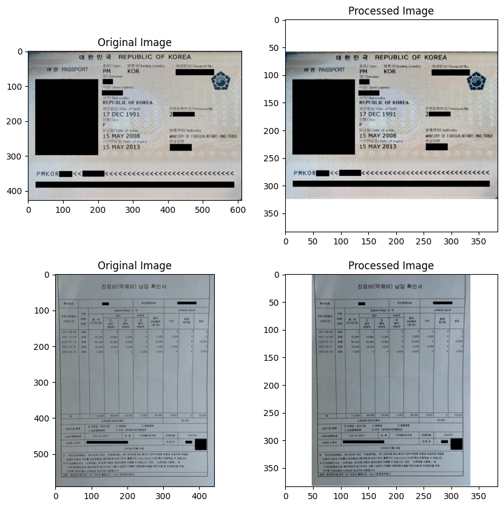
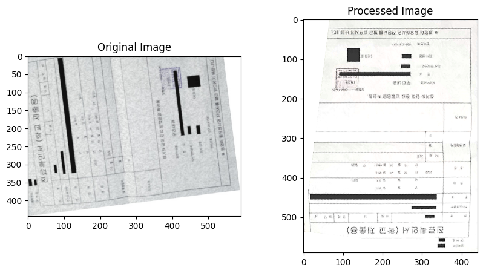

# 김나리
|발표, EDA, Pre-processing, Data Augmentation, Modeling|

### EDA
- class 별 학습데이터의 양이 고르지 못함.

- 이미지들의 사이즈 분포 시각화.

### Data Preprocessing
- 이미지의 크기를 모델의 최적사이즈에 맞추기좋게 이미지를 가운데에 두고 여백을 주면서 정방형으로 만든 다음 리사이즈.
  
- 이미지의 회전 바로잡기(Denosing)
  
  

### Modeling Process
1. Augmentation으로 데이터증강하여 3개의 모델 실험
2. 하이퍼파라미터 튜닝
3. 데이터를 오프라인으로 증강시켜 학습. (약 25000개)
4. 평가데이터 Denoising
5. 훈련데이터중 일부도 Denosing
6. Paddle OCR을 이용한 단어 추출 후 단어사전을 만들어 분류 
    (3, 4, 7, 14 클래스만 적용함)
https://api.wandb.ai/links/narykkim/p2l1gyy0

### 아쉬웠던 점
- 데이터를 이미지와 문서로 분류해서 다시 분류하는 시스템을 만들고 싶었는 데, 초반에 데이터량이 적다보니 좋은 결과가 나오지 않아 중단했다. 이미지를 오프라인으로 증강한 후에 시도했으면 좋았을텐데 그러지 못해 아쉽다.

### 얻은 것
- 수업을 듣고 바로 대회를 하니 적용을 바로 할수 있어 좋다.
- 발표준비하면서 모델에 대하여 조금 더 알수 있었다.
- Augraphy나 layoutLM 등 조원님들이 공부해서 공유해주신 소중한 샘플코드

### 시도해보고 싶은 것
- Paddle OCR을 시간관계상 대충하고 지나갔는 데, 좀더 체계적으로 만들어보고싶다. OCR 대회를 기대해본다.